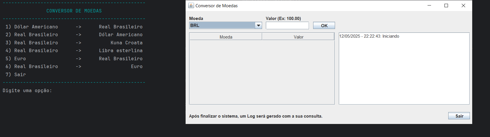

<h1 align="center"> Conversor de Moedas </h1>

# Introdução

No mundo globalizado de hoje, onde transações internacionais são cada vez mais comuns, ter uma ferramenta confiável para conversão de moedas é essencial. Este projeto consiste em um conversor de moedas desenvolvido em Java, capaz de obter taxas de câmbio atualizadas e realizar conversões de forma rápida e eficiente.
Com uma interface intuitiva e funcionalidades robustas, o conversor permite aos usuários calcular valores em diferentes moedas sem complicações. Além disso, ele pode ser integrado a APIs externas para garantir que as taxas de câmbio estejam sempre atualizadas, proporcionando precisão nos cálculos financeiros.
Este projeto é uma excelente oportunidade para aprimorar habilidades de programação, manipulação de APIs e desenvolvimento de aplicações úteis para o dia a dia. Vamos explorar sua implementação e os desafios envolvidos na criação dessa ferramenta.

# Instalação e Configuração do Conversor de Moedas:

# 1. Configurar o IntelliJ IDEA
- Certifique-se de que o IntelliJ IDEA está instalado no seu computador.
- Abra o IntelliJ e crie um novo projeto Java.
- Escolha JDK 11 ou superior, caso ainda não tenha configurado.

# 2. Adicionar a Biblioteca GSON
A biblioteca GSON é usada para manipulação de objetos JSON no Java.
- Baixe o arquivo JAR do GSON no repositório oficial.
- No IntelliJ IDEA, vá para:
- File > Project Structure > Libraries
- Clique em + e selecione Java
- Localize o arquivo JAR do GSON que você baixou e adicione ao projeto.

# 3. Integrar API Exchange Online
A API Exchange Online fornece as taxas de câmbio atualizadas. Para utilizá-la:
- Obtenha uma chave de API registrando-se na plataforma.
- Faça requisições HTTP para buscar taxas de câmbio:
- Substitua "USD" e "BRL" pelos códigos das moedas que deseja converter.

# 4. Compilar e Executar
- No IntelliJ IDEA, a versão usada foi 2025.1.1.1, clique em Run para compilar e executar seu código.
- Certifique-se de que as dependências foram carregadas corretamente.
- Teste diferentes moedas para garantir que os cálculos estão corretos.

# 5. Como Usar
- O usuário seleciona uma opção de conversão e insere um valor.
- O programa corrige o formato da entrada e realiza a conversão.
- Caso o usuário deseje, pode testar um modo gráfico (GUI) no final da execução.

# 6. Explicação do Código
O código funciona da seguinte forma:
- Usa um loop do-while para garantir que o usuário possa inserir repetidamente valores até decidir sair.
- Garante entradas válidas verificando se o usuário digitou um número correto.
- Utiliza switch expressions para criar objetos BuscaMoeda com os tipos de moeda desejados.
- Obtém a conversão do valor via ConverteMoeda e apresenta no terminal.
- Apresenta um modo gráfico caso o usuário opte por isso.

# Possíveis Melhorias
- Melhorar o modo gráfico e adicionar um frontend para facilitar o uso.
- Melhorar a exportação dos dados para Log.

# Conclusão
Este programa é um excelente exemplo de como criar um sistema de conversão de moeda interativo em Java. Você pode expandi-lo adicionando novas funcionalidades e tornando-o mais dinâmico.

# Guia de contribuição:

Qualquer melhoria e correções serão bem vindas, entre em contato.

# Contato:

# Contribuidores:

# Agradecimentos Especiais:

